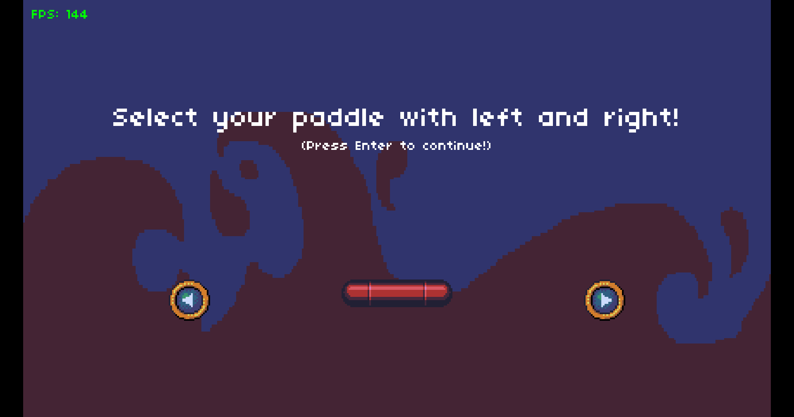

# Breakout

## Description

A simple implementation of the well-known Breakout game developed using lua's LÖVE2D framework. This implementation is inspired by the 
old retro aesthetics. In this game, the player controlls a padel that moves only left and right and the goal is to keep bouncing 
the ball to destroy all the brick in the scene while preventing the ball from falling below the paddle. 

## Installation
<ul>
<li>Install <a href="https://love2d.org/" >LÖVE2D framework</a> </li>
<li>Clone the repo then open terminal in the download folder</li>
<li>Type "love ." in the opened terminal to run the game</li>
</ul>
